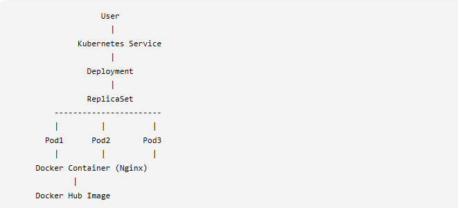

# Kubernetes Containerized Web Application

## 📌 Project Overview

This project demonstrates the end-to-end containerization and deployment of a web application on a Kubernetes cluster.

The web application is containerized using Docker with Nginx as the web server. The Docker image is pushed to Docker Hub and deployed on a Kubernetes cluster using Kubernetes Deployment and Service resources.

The project demonstrates hands-on Kubernetes concepts including Deployments, ReplicaSets, Pods, Services, ConfigMaps, Secrets, Resource Requests and Limits, Liveness and Readiness Probes, Self-Healing, Scaling, Rolling Updates, Rollbacks, Node Affinity, and Namespaces.

---

## 🏗️ Architecture



### Application Flow

```text
Application Code
       |
       v
   Dockerfile
       |
       v
  Docker Image
       |
       v
   Docker Hub
       |
       v
Kubernetes Deployment
       |
       v
    ReplicaSet
       |
       v
 Multiple Pods
       |
       v
Kubernetes Service
       |
       v
      User
```

---

## 🚀 Technologies Used

* Docker
* Docker Hub
* Kubernetes
* Kind
* Nginx
* YAML
* Git
* GitHub

---

## ☸️ Kubernetes Resources Used

* Namespace
* Deployment
* ReplicaSet
* Pods
* NodePort Service
* ConfigMap
* Secret
* Liveness Probe
* Readiness Probe
* Resource Requests
* Resource Limits
* Node Affinity

---

## ✨ Project Features

* Containerized a static web application using Docker
* Used Nginx Alpine as a lightweight base image
* Pushed versioned Docker images to Docker Hub
* Deployed the application on a local Kind Kubernetes cluster
* Configured multiple application replicas using Kubernetes Deployment
* Exposed application Pods using a Kubernetes Service
* Used ConfigMap for non-sensitive application configuration
* Used Kubernetes Secret for sensitive configuration
* Configured CPU and memory Requests and Limits
* Implemented Liveness Probe for container health monitoring
* Implemented Readiness Probe to control application traffic
* Tested Kubernetes Pod Self-Healing
* Performed manual horizontal scaling
* Performed a Rolling Update from application version v1 to v2
* Tested Kubernetes Deployment Rollback
* Implemented Node Affinity for Pod scheduling
* Used a Kubernetes Namespace for logical resource organization
* Documented implementation steps and project evidence in GitHub

---

## 📁 Project Structure

```text
kubernetes-containerized-webapp/
│
├── app/
│   ├── Dockerfile
│   └── index.html
│
├── architecture/
│   └── project-architecture.png
│
├── docs/
│   ├── docker-setup.md
│   └── kubernetes-deployment.md
│
├── k8s/
│   ├── configmap.yaml
│   ├── deployment.yaml
│   ├── namespace.yaml
│   ├── secret.yaml
│   └── service.yaml
│
├── screenshots/
│   ├── configmap-created.png
│   ├── docker-container-running.png
│   ├── docker-image-built.png
│   ├── dockerhub-image.png
│   ├── dockerhub-v2.png
│   ├── kubernetes-node-ready.png
│   ├── kubernetes-three-pods.png
│   ├── kubernetes-webapp-running.png
│   ├── kubernetes-self-healing.png
│   ├── node-affinity.png
│   ├── pod-description.png
│   ├── rollback.png
│   ├── rolling-update.png
│   ├── scaling.png
│   ├── secret-created.png
│   └── webapp-v1.png
│
└── README.md
```

---

# 🐳 Docker Implementation

## Build Docker Image

Navigate to the application directory:

```bash
cd app
```

Build the Docker image:

```bash
docker build -t kubernetes-webapp:v1 .
```

Verify the image:

```bash
docker images
```

---

## Run Docker Container

Run the application locally:

```bash
docker run -d --name kubernetes-webapp-container -p 8080:80 kubernetes-webapp:v1
```

Verify the running container:

```bash
docker ps
```

Access the application:

```text
http://localhost:8080
```

---

## View Container Logs

```bash
docker logs kubernetes-webapp-container
```

The Nginx access logs can be used to verify HTTP requests reaching the application.

---

# 📦 Docker Hub

## Tag Docker Image

```bash
docker tag kubernetes-webapp:v1 shubhamdocker2025/kubernetes-webapp:v1
```

## Push Docker Image

```bash
docker push shubhamdocker2025/kubernetes-webapp:v1
```

The Docker image is stored in Docker Hub and used by Kubernetes to create application containers.

---

# ☸️ Kubernetes Cluster

This project uses a local Kubernetes cluster created with Kind.

## Verify Cluster

```bash
kubectl cluster-info
```

Check Kubernetes nodes:

```bash
kubectl get nodes
```

The node should display the `Ready` status.

---

# 📂 Kubernetes Namespace

The project uses the `cloud-project` namespace to logically organize Kubernetes resources.

Create the namespace:

```bash
kubectl apply -f k8s/namespace.yaml
```

Verify:

```bash
kubectl get namespaces
```

---

# ⚙️ ConfigMap

The ConfigMap stores non-sensitive application configuration separately from the container image.

Create the ConfigMap:

```bash
kubectl apply -n cloud-project -f k8s/configmap.yaml
```

Verify:

```bash
kubectl get configmap -n cloud-project
```

Describe the ConfigMap:

```bash
kubectl describe configmap webapp-config -n cloud-project
```

---

# 🔐 Kubernetes Secret

The Kubernetes Secret stores sensitive application configuration.

Create the Secret:

```bash
kubectl apply -n cloud-project -f k8s/secret.yaml
```

Verify:

```bash
kubectl get secret -n cloud-project
```

Describe the Secret:

```bash
kubectl describe secret webapp-secret -n cloud-project
```

> Note: Kubernetes Secrets are not encrypted by default merely because their manifest values are Base64 encoded. Production clusters should use appropriate encryption at rest, RBAC, and external secret-management practices where required.

---

# 🚀 Kubernetes Deployment

Deploy the application:

```bash
kubectl apply -n cloud-project -f k8s/deployment.yaml
```

Verify the Deployment:

```bash
kubectl get deployments -n cloud-project
```

Check ReplicaSets:

```bash
kubectl get rs -n cloud-project
```

Check application Pods:

```bash
kubectl get pods -n cloud-project
```

The Deployment maintains the configured desired number of application Pods through a ReplicaSet.

---

# 🌐 Kubernetes Service

Create the Service:

```bash
kubectl apply -n cloud-project -f k8s/service.yaml
```

Verify:

```bash
kubectl get svc -n cloud-project
```

Check Service endpoints:

```bash
kubectl get endpoints kubernetes-webapp-service -n cloud-project
```

The Service uses Pod labels to identify application Pods and forwards traffic to container port 80.

---

# 🌍 Access the Application

For local testing, use Kubernetes port forwarding:

```bash
kubectl port-forward -n cloud-project service/kubernetes-webapp-service 8081:80
```

Access the application:

```text
http://localhost:8081
```

Port forwarding is used for local project testing. In a cloud-based Kubernetes environment, an Ingress or LoadBalancer Service can be used depending on the architecture.

---

# ❤️ Liveness Probe

The Deployment includes an HTTP Liveness Probe.

The Liveness Probe checks whether the application container is healthy.

If the probe repeatedly fails, Kubernetes can restart the unhealthy container.

---

# ✅ Readiness Probe

The Readiness Probe checks whether the application is ready to receive network traffic.

If the Readiness Probe fails, the Pod is temporarily removed from Service endpoints until it becomes ready again.

---

# 📊 Resource Requests and Limits

The application containers are configured with CPU and memory Requests and Limits.

Resource Requests help the Kubernetes scheduler determine the resources required by a Pod.

Resource Limits define the maximum CPU and memory resources a container can consume.

Verify the configuration:

```bash
kubectl describe pod <pod-name> -n cloud-project
```

---

# 🔄 Kubernetes Self-Healing

The project demonstrates Kubernetes self-healing behavior.

Check running Pods:

```bash
kubectl get pods -n cloud-project
```

Delete one application Pod:

```bash
kubectl delete pod <pod-name> -n cloud-project
```

Check the Pods again:

```bash
kubectl get pods -n cloud-project
```

The ReplicaSet automatically creates a replacement Pod to maintain the desired replica count.

---

# 📈 Manual Scaling

Scale the Deployment to five replicas:

```bash
kubectl scale deployment kubernetes-webapp-deployment --replicas=5 -n cloud-project
```

Verify:

```bash
kubectl get pods -n cloud-project
```

Scale down:

```bash
kubectl scale deployment kubernetes-webapp-deployment --replicas=2 -n cloud-project
```

This project demonstrates manual horizontal scaling of application Pods.

---

# 🔄 Rolling Update

A second version of the application was created to demonstrate Kubernetes Rolling Updates.

## Build Version 2

```bash
docker build -t kubernetes-webapp:v2 .
```

## Tag Version 2

```bash
docker tag kubernetes-webapp:v2 shubhamdocker2025/kubernetes-webapp:v2
```

## Push Version 2

```bash
docker push shubhamdocker2025/kubernetes-webapp:v2
```

## Update Deployment Image

```bash
kubectl set image deployment/kubernetes-webapp-deployment kubernetes-webapp=shubhamdocker2025/kubernetes-webapp:v2 -n cloud-project
```

Monitor the rollout:

```bash
kubectl rollout status deployment/kubernetes-webapp-deployment -n cloud-project
```

A Rolling Update gradually replaces old Pods with Pods running the new application version.

---

# ⏪ Kubernetes Rollback

View Deployment rollout history:

```bash
kubectl rollout history deployment/kubernetes-webapp-deployment -n cloud-project
```

Rollback to the previous Deployment revision:

```bash
kubectl rollout undo deployment/kubernetes-webapp-deployment -n cloud-project
```

Verify rollout status:

```bash
kubectl rollout status deployment/kubernetes-webapp-deployment -n cloud-project
```

Rollback allows the application to return to a previous stable Deployment revision if a new version has issues.

---

# 🖥️ Node Affinity

Node Affinity is configured using:

```text
requiredDuringSchedulingIgnoredDuringExecution
```

The Deployment requires a node with the following label:

```text
disktype=ssd
```

Label the Kind node:

```bash
kubectl label node cloud-project-control-plane disktype=ssd
```

Verify the node label:

```bash
kubectl get nodes --show-labels
```

Node Affinity controls Pod scheduling based on node labels.

In this project, application Pods are scheduled on a node matching the `disktype=ssd` requirement.

---

# 🔍 Project Verification

View all application resources in the project namespace:

```bash
kubectl get all -n cloud-project
```

Check Pods:

```bash
kubectl get pods -n cloud-project
```

Check Deployment:

```bash
kubectl get deployment -n cloud-project
```

Check ReplicaSets:

```bash
kubectl get rs -n cloud-project
```

Check Service:

```bash
kubectl get svc -n cloud-project
```

Check ConfigMap:

```bash
kubectl get configmap -n cloud-project
```

Check Secret:

```bash
kubectl get secret -n cloud-project
```

---

# 📸 Project Evidence

The `screenshots` directory contains project implementation evidence, including:

* Docker image build
* Running Docker container
* Docker Hub image
* Docker image version v2
* Kubernetes node status
* Three running application Pods
* Kubernetes application access
* Kubernetes Self-Healing
* ConfigMap creation
* Kubernetes Secret
* Pod resource and health probe configuration
* Manual scaling
* Rolling Update
* Rollback
* Node Affinity

---

# 🎯 Key Learnings

Through this project, I gained hands-on experience with:

* Creating Docker images using Dockerfiles
* Running and troubleshooting Docker containers
* Pushing versioned images to Docker Hub
* Deploying containerized applications on Kubernetes
* Understanding Deployment, ReplicaSet, and Pod relationships
* Exposing applications using Kubernetes Services
* Managing application configuration using ConfigMaps
* Managing sensitive configuration using Kubernetes Secrets
* Configuring CPU and memory Requests and Limits
* Implementing Liveness and Readiness Probes
* Testing Kubernetes Self-Healing
* Scaling Kubernetes Deployments
* Performing Rolling Updates
* Performing Deployment Rollbacks
* Implementing Node Affinity
* Organizing Kubernetes resources using Namespaces
* Managing Kubernetes resources using kubectl
* Documenting a hands-on DevOps project using Git and GitHub

---

# 👨‍💻 Author

**Shubham Shewale**

GitHub: `shubhushewale`

LinkedIn: `shubham-shewale-6aa444224`

---

## ⭐ Project Purpose

This project was created as a hands-on portfolio project to demonstrate practical Docker and Kubernetes skills for Cloud Engineer and Junior DevOps Engineer roles.
